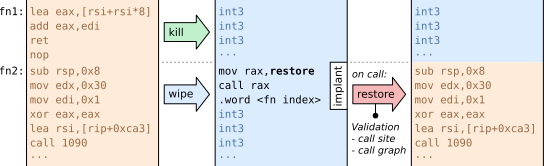

# Context-Based Text Elimination (CTE)

CTE is a dynamic code elimination tool that minimizes the attack
surface of running programs via dynamic elimination and restoration of
code.  The goal is to reduce the available code exploitable by ROP/JOP
attacks.

CTE removes (currently) unused functions (from the main executable and
dynamic libraries) by overwriting their bodies with trap instructions.
When a removed (wiped) function is called legitimately, the original
body gets restored.  A small implant placed at the start of the
removed body invokes a restore handler, which performs validity checks
and re-loads the original body.  CTE can also permanently remove
(kill) functions.



CTE can be used to eliminate functions on the basis of different
contexts (e.g., on thread level, see below), which, depending on the
target, makes it possible to remove very large parts of the code (even
from the main binary).

CTE consists of a run-time library, libCTE, and a binary analysis tool
CTEmeta, which gathers static information on a per-binary/library
level.  CTE relies solely on ELF symbols and the compiled code.
It does not require the source code or debugging information.

CTE was developed as part of the paper
[Thread-Level Attack-Surface Reduction](https://sra.uni-hannover.de/p/tlasr-lctes23).


## Requirements

* CTE currently works on the x86-64 architecture.
* It is compatible with ELF executables/libraries and was tested
  on GNU/Linux with various libraries.
* It requires position-independent code.
* All function symbols need to be present in the ELF files --
  or alternatively, CTE can use dedicated symbol files,
  such as provided by the [dbgsym packages in Debian](https://wiki.debian.org/DebugPackage)

## How it works

On initialization, libCTE scans the program binary and all loaded
libraries for function symbols with libelf. For each function, libCTE
creates a record that stores a copy of the original body in a
non-executable non-writable memory region.  libCTE requires static
callgraph information generated by CTEmeta in advance, stored in extra
files.

CTE allows eliminating functions within a context specified by a
wiping rule set, which determines for each function in the process
(binary+libraries) whether it should be loaded, permanently removed
(killed), or temporarily removed and restored on demand (wiped).

With `cte_wipe()`, CTE overwrites the to-be-removed function bodies
(according to the policy / wiping rule set) with debug trap
instructions (int3).

For the functions that are not permanently removed (killed), libCTE
installs a short trampoline (16 bytes) at the function entry
consisting of a call instruction to a restore handler and an index of
the function record. When the regular control flow calls a wiped
function, the trampoline calls the restore handler, which saves the
current context, validates the call and copies the saved function body
back to the original location.


## Build

This repository uses [git-external](https://github.com/stettberger/git-external).
Before building, run `./init` to pull the dependencies.

LibCTE requires the dynamic libraries `libelf` and `libdl`.
CTEmeta depends on [Zydis](https://github.com/zyantific/zydis)
(statically linked, pulled as git-external) and `libelf`.

Build libCTE and CTEmeta via `make` in the respective directory.

There is no `install` target yet.  You may copy the binaries
(`ctemeta/ctemeta`, `ctemeta/ctemeta-elf`) to a diretory in your
`PATH` and the library (`libcte/libcte.so`) to a library location.
The header `libcte/cte.h` is used for integrating libCTE into the
target program.


## Usage: CTEmeta

CTEmeta gathers static callgraph information necessary for libCTE.
The meta information is written to a dedicated CTEmeta file.
LibCTE expects the CTEmeta file `libXX.so.cte` in the same directory as
`libXX.so`.

Generate a CTEmeta file:
```sh
ctemeta libXX.so libXX.so.cte
```
Refer to `ctemeta -h` for more information.


Use the `ctemeta-elf` script to generate CTEmeta information for an
executable/library and all its dependencies:
```sh
ctemeta-elf example-binary
```
The CTEmeta files are placed in the directory of the corresponding binary.
You may have to call it as root to access `/lib` and co.


## Usage: libCTE

CTE requires manual integration into the target program.


### Initialization

The library is initialized with the `cte_init`.
Initialization must be performed once before wiping the first time.

It takes a `cte_flag` parameter:
* `CTE_STRICT_CALLGRAPH`:
  Enable callgraph vailidation when restoring a function.
* `CTE_STRICT_CTEMETA`:
  Fail if there is no CTEmeta information for a binary/library

```C
int cte_init(enum cte_flags flags);
```

### Wiping Rules

libCTE allows for fine-grained control of the elimination strategy
using the `cte_rules` data structure.  Each function in the process
(binary+libraries), can be specified to be loaded, permanently removed
(killed), or temporarily removed and restored on demand (wiped).

```C
enum cte_wipe_policy {
  CTE_LOAD, // Function should remain loaded
  CTE_WIPE, // Eliminate function but install the trampoline
  CTE_KILL, // Remove function permanently
};
typedef struct { cte_wipe_policy policy[]; ... } cte_rules;
```

The `cte_rules_init` function initializes an empty set of rules, using
the given default `cte_wipe_policy` by default for all functions;
`cte_rules_free` deallocates a previously allocated set of rules.

```C
cte_rules* cte_rules_init(enum cte_wipe_policy default_policy);
void       cte_rules_free(cte_rules* rules);
```

To set a policy for all functions whose address was taken, use
`cte_rules_set_indirect`. To set a policy for a single function (and
its subfunctions), use `cte_rules_set_func`. Alternatively, use
`cte_rules_set_fnmatch` to set a policy for all functions whose name
matches a `fnmatch`-compatible pattern.

```C
unsigned cte_rules_set(cte_rules* rules, enum cte_wipe_policy policy);
unsigned cte_rules_set_func(cte_rules* rules, enum cte_wipe_policy policy, void* func, bool recursive);
unsigned cte_rules_set_fnmatch(cte_rules* rules, enum cte_wipe_policy policy, char* pattern, bool recursive);
unsigned cte_rules_set_indirect(cte_rules* rules, enum cte_wipe_policy policy);
```

### Eliminating Functions

To eliminate functions call `cte_wipe` with a pointer to a `cte_rules`
data structure.

```C
int cte_wipe(cte_rules *rules);
```

### Combination with Address-Space Views

CTE supports integration with address-space views (`mmview`s) to allow
thread-level debloating.

Address-space views are a way of managing multiple slightly differing
instances of a program's memory, allowing CTE to have different text
segments for different threads in the process.  You need the extended
Linux kernel to use address-space views.

The modified kernel is available here:
https://github.com/luhsra/linux-mmview

The `mmview.h` header provides access to the `mmview` functionality:
`mmview_create` creates a new address-space view, `mmview_delete`
marks a view for deletion, and `mmview_migrate` switches to a given
view; `mmview_current` retrieves the currently active memory view.
Note that `cte_wipe` must be called after `mmview_create` to ensure
that the view's memory is correctly initialized.

```C
int cte_mmview_unshare(void);
mmview_t mmview_create(void);
int      mmview_delete(mmview_t id);
mmview_t mmview_migrate(mmview_t id);
mmview_t mmview_current(void);
```

